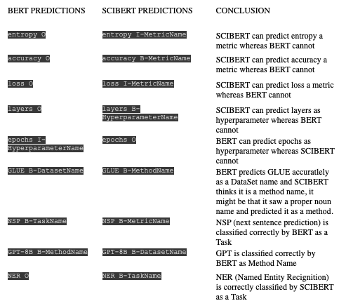

# Scientific-Entity-Recognition

BERT ANLP2 ipynb file contains all the modelling which takes the output of label studio and generates the required output.

The data folder contains the annotated dataset which was split into train and dev for development and the whole thing was used for making the final model

dataprep.ipnb takes the pdfs and generates file readable by label studio

data_collect.py contains the functions that we created for scraping data

INSIGHTS:

From more detailed analysis we see that, each models are better at predicting certain features. Scibert is better at predicting Metrics and Hyperparameters. This also makes sense considering that SciBert is trained on scientic data. Whereas, BERT is better at predicting Methods, Datasets and Tasks. However there are some caseswhere where this trend is not followed which can be seen from the table.
